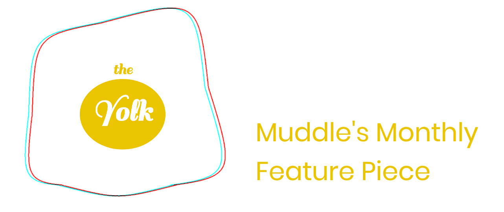
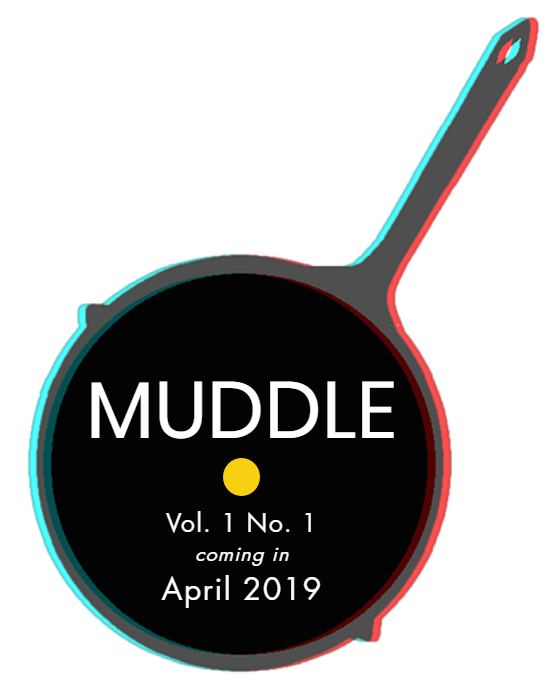

# MUDDLE
The public GitHub repository for MUDDLE: a digital lit-mag devoted to celebrating the messiness of composition. 
Created by Taylor Brown, Digital Humanities Graduate Student at Loyola University Chicago. 
© BitByteBit Publishing 2018 

### Check back often for progress updates on the website and our first Call for Play! 
